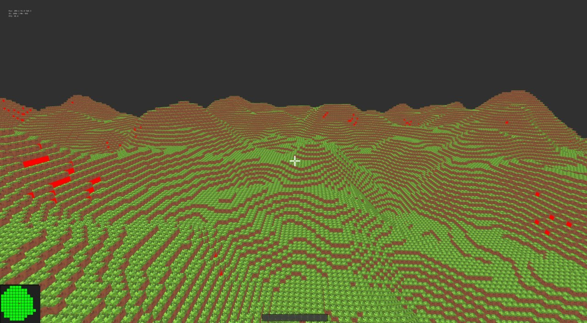

# GTNH Platform

**A from-scratch voxel game engine and simulation platform inspired by GregTech: New Horizons.**

Not a mod — a standalone distributed implementation (ECS simulation, binary protocol,
13 service directories). Part platform for experimenting with GTNH-scale mechanics,
part playable game with world, machines, pipes, crafting, electric tools, and quests.

Built with C++ performance core + Go sidecars. Binary protocol (FlatBuffers + TCP).



## Git History & Contributing

**Git history**: full multi-commit history on branch `main` (110+ commits since 2026-06-20).
Open-source remote: `github.com/lexasub/gtnh-platform`.

**Looking for contributors.** Areas that need work:

| Area | Scope / keywords |
|------|-----------------|
| **Inventories** | EntityStateStore persistence, inventory drag-and-drop polish, WorldContainerInventory |
| **Crafting** | RecipeManager YAML recipes, server-authoritative grid, condition evaluation |
| **Heat transfer** | Boiler, overheat, water→steam, explosion, thermal dynamics, neighbor propagation |
| **Pipes/cables** | PipeNetwork BFS, CableGraph, HeatLoss, transformers, item/fluid transport |
| **UI** | MachineWindow, Drill UI, inventory drag-and-drop, ImGui widgets |
| **Assets** | Textures, models, sprites for items, blocks, and machines |
| **Questbook** | Quest library, quest data, completion tracking, rewards, exchange market |
| **Game modes** | Survival (no mobs — ore gen, gating, tools), Creative (build mode), Adventure, Spectator |
| **Protocol** | Resolve GatewayMsg C++ constants vs FlatBuffers `GatewayPayload` union divergence |
| **Tests** | Contract/integration tests: protocol frames, router pub/sub flows, RPC boundaries, service handoff |

Overall **everything works**, but there are bugs — code was written fast, architecture changed on the fly. Many places have **hardcoded values** that need architectural workarounds.

**Architecture discussions welcome.** The process:
1. Open a PR with architecture change proposals for a specific component
2. I analyze it, we discuss, refine
3. Once architecture is agreed upon — we create a task, done by me and/or you

The goal: understanding and fixing a component should require fewer changes and less context.

## Architecture

> **Note:** This diagram is approximate, incomplete, and may be inaccurate. For the authoritative topology, see the [C4 diagrams](doc/c4/) — especially `level2-container.puml` and `level3-*.puml`.

```
                 ┌─────────────┐
                 │   Client    │
                 │  (bgfx)     │
                 └──────┬──────┘
                        │  TCP/FlatBuffers (ctrl :7777 + bulk :7778)
                        │  PlayerAction / ChunkData / CraftRequest / ...
                 ┌──────▼──────┐
                 │  Gateway    │
                 │  (C++)      │
                 │  IoUring    │
                 └──────┬──────┘
                        │  pub/sub: Register / Subscribe / Publish
                        │  topics: player.* / world.* / recipe.* / ...
                 ┌──────▼──────────┐
                 │  MessageRouter  │ ◄── Go :4000, pub/sub broker
                 │  (Go)           │     3 priority levels, heartbeat,
                 └──────┬──────────┘     service discovery
                        │
        ┌───────────────┼───────────────┬───────────────┐
        │               │               │               │
   ┌────▼─────┐   ┌────▼─────┐   ┌────▼─────┐   ┌────▼──────┐
   │ Chunk    │   │Simulation│   │  Pipe    │   │ Entity    │
   │ Store    │   │  Core    │   │ Network  │   │ StateStore│
   │ (C++)    │   │ (C++)    │   │ (C++)    │   │ (C++)     │
   └────┬─────┘   └────┬─────┘   └────┬─────┘   └────┬──────┘
        │               │               │               │
   ┌────▼─────┐   ┌────▼─────┐   ┌────▼────────┐  ┌───▼────────┐
   │ WorldGen │   │ MetaDB   │   │RecipeMgr    │  │ Spatial    │
   │ (C++,lib)│   │ (Go)     │   │ (:5555)     │  │ Index      │
   └──────────┘   └──────────┘   └─────────────┘  │ (stub,     │
                                                   │  not built)│
                                                   └────────────┘
```

**Connection topology:**
- **All services** connect to MessageRouter for pub/sub (TCP, FlatBuffers frames).
- **Gateway** additionally accepts external client connections (dual-port: ctrl + bulk).
- **SimulationCore → ChunkStore** has direct RPC for block operations.
- **SimulationCore → EntityStateStore** has direct TCP RPC for entity state.
- **SimulationCore → PipeNetwork** has direct RPC for energy/fluid tick.
- **RecipeManager** is a standalone RPC service on the router (:5555).

## Service Map

| #  | Service            | Language | Responsibility                               |
|----|--------------------|----------|----------------------------------------------|
| 1  | MessageRouter      | Go       | Internal pub/sub, heartbeat, discovery       |
| 2  | Gateway            | C++      | TCP gateway, io_uring, interest management   |
| 3  | ChunkStore         | C++      | Block data, LMDB persistence, io_uring       |
| 4  | WorldGenerator     | C++      | Terrain + ore/tree generation (library)      |
| 5  | SimulationCore     | C++      | ECS, multiblocks L2/L3, quests, 20 Hz tick   |
| 6  | PipeNetwork        | C++      | Energy/fluid/item flow graphs, HeatLoss      |
| 7  | SpatialIndex       | C++      | **STUB** — not implemented, not built        |
| 8  | EntityStateStore   | C++      | Entity state persistence (LMDB), TCP RPC     |
| 9  | MetaDB             | Go       | Player saves, quests, inventories            |
| 10 | GameClient         | C++      | bgfx render, ImGui, input, physics           |
| 11 | RecipeManager      | C++      | Recipe check/craft/catalog queries (:5555)   |
| 12 | StorageInterfaces  | C++      | Header-only storage interfaces (no binary)   |
| 13 | Validation         | C++      | Item/block validation (not in default build) |

Note: **ChestSync** is a protocol feature (ChestOpenReq/Resp) + client chest window, not a service.
**DrillSystem** is an ECS system inside SimulationCore, not a service.

## Key Design Decisions

- **Chunk format**: 32³ blocks — 192 KB per chunk (blocks + meta + extra), fits L3 cache
- **Multiblocks**: Not chunk-owned. Simulation Service owns controllers; Chunk Store only stores `mbID` references in the meta-layer
- **Language split**: Hot path = C++ only. Sidecars = Go
- **I/O**: **io_uring is the primary async backend** (Linux-native, via libgtnh-net). Epoll/IOCP/kqueue fallbacks are not implemented
- **Protocol**: FlatBuffers (zero-copy) over TCP (length-prefixed frames). Wire protocol = C++ `GatewayMsg` constants (41 types, 1-based); the FlatBuffers `GatewayPayload` union in gateway.fbs is stale — cleanup is an active task

## Build

**NEVER rebuild from scratch.** Dependencies are pre-installed in `cmake-build-debug/` / `cmake-build-release/` (Conan toolchain inside — deleting them requires `conan install` + network).

**Go 1.22+** — for MessageRouter and MetaDB services.

```bash
# Build (use existing cmake-build dir — has Conan toolchain already)
cd cmake-build-debug
ninja -j5
```

Or with CMake presets: `cmake --preset conan-release` (see CMakePresets.json).

## Quick Start

```bash
./run.sh                    # build ninja + rebuild Go services + start everything
./run.sh --all              # also pipenetworkd / spatialindexd / validationd
./run.sh --no-client        # skip the game client
```

Or manually (order matters, from repo root):

```bash
./cmake-build-debug/src/services/message_router/routerd            # 1. Internal pub/sub (Go, :4000)
./cmake-build-debug/src/services/chunk_store/chunkd                # 2. World persistence (C++, :5001)
./cmake-build-debug/src/services/entity_state_store/entitystated   # 3. Entity state (C++, :5200)
./cmake-build-debug/src/services/gateway/gatewayd                  # 4. TCP gateway (C++, :7777 ctrl + :7778 bulk)
./cmake-build-debug/src/services/simulation_core/simcored_exec     # 5. Simulation (C++, 20Hz tick)
./src/services/meta_db/metadbd                                     # 6. Player DB (Go, :5005 + :5006)
./cmake-build-debug/src/services/pipe_network/pipenetworkd         # 7. Energy/fluid transport (C++)
./cmake-build-debug/bin/gameclientd                                # 8. Game client (C++, bgfx)
```

**Tests**:
```bash
cd cmake-build-debug && ctest --output-on-failure -j$(nproc)
```

## Project Structure

```
src/
├── src/
│   ├── services/
│   │   ├── message_router/    # Go pub/sub broker, service discovery
│   │   ├── gateway/           # TCP gateway, io_uring, interest mgmt
│   │   ├── chunk_store/       # LMDB-backed block storage, io_uring
│   │   ├── world_generator/   # Terrain + ore/tree gen (library, no binary)
│   │   ├── simulation_core/   # ECS, multiblocks L2/L3, quests, 20 Hz tick
│   │   ├── pipe_network/      # Energy/fluid/item flow graphs
│   │   ├── spatial_index/     # STUB — not built (R-tree/Octree planned)
│   │   ├── entity_state_store/ # Entity state persistence, TCP RPC
│   │   ├── meta_db/           # Player saves, quests, inventories (Go)
│   │   ├── recipe_manager/    # Standalone recipe RPC service (:5555)
│   │   ├── storage_interfaces/ # Header-only storage interfaces
│   │   ├── validation/        # Item/block validation (not in default build)
│   │   └── game_client/       # bgfx render, ImGui, input, physics
│   └── protocol/              # FlatBuffers schemas (12 .fbs)
├── src/libs/                  # libgtnh-net, quest_lib, recipe_manager_lib, ...
├── cmake-build-debug/         # CMake build directory (Conan toolchain)
├── data/                      # YAML recipes, item registry
└── docs/                      # Service documentation
```

## Status

- ✅ **Core MVP**: 13 service directories, FlatBuffers protocol, MessageRouter pub/sub
- ✅ **Crafting Pipeline**: Workbench crafting end-to-end (CraftRequest→RecipeManager→CraftResponse), YAML recipes (14 files incl. macerator.yaml), 3×3 positional matching, ConditionEvaluator with MachineState from ECS
- ✅ **PipeNetwork**: CableGraph + PipeNetworkManager — energy/fluid/item BFS, per-tick energy demand, loss calc, HeatLoss, item buffering, tiered cables, transformers
- ✅ **Electric Tools**: DrillSystem (spiral BFS, progress, energy), BatteryBufferSystem, WrenchHandler, SideConfig
- ✅ **Autonomous Mining**: DrillSystem — spiral BFS ore search, mining progress, output buffer, energy consumption
- ✅ **Heat/Boiler**: HeatTransferSystem — 6-neighbor propagation, overheat detection (90%/100%), ExplosionSystem, environment cooling, heat propagation to adjacent furnaces
- ✅ **Ore Generation**: OreGenerator — GTNH-style vein system, primary/secondary/sporadic, 3D Simplex noise, SIMD, ores.json config; TreeGenerator + SurfaceHeights
- ✅ **Multiblocks L2+L3**: pattern registry, EBF/Boiler/LCR systems, hatches, item IO, block-break guard, persistence, client GUI, FlowHandlers
- ✅ **Questbook**: quest system end-to-end — MetaDB quest storage, INVENTORY/EXCHANGE detection, era transitions, exchange market, rewards → inventory, QuestBookWindow (toggle `~`)
- ✅ **Game Modes**: console + `/gamemode` command (SURVIVAL/CREATIVE/ADVENTURE/SPECTATOR), mode sync gateway↔client, game scenarios
- ✅ **Survival Physics**: gravity, jump, sneak, per-axis AABB block collision
- ✅ **Client UI**: hotbar + block picking, block atlas/UV textures, NEI panel (`U`), machine windows (data-driven), chest window, drag-and-drop inventory (DragManager, 14 tests), crafting grid, RecipeInspectWindow (`R`), CreativeMenu (`Tab`)
- 🟡 **Inventory System**: protocol + MetaDB + EntityStateStore implemented, drag-and-drop done; server-authoritative grid still open
- 🟡 **Sound**: miniaudio linked in CMake, no audio code yet
- 🟡 **Drill UI**: tooltip with energy/progress only — no dedicated window
- 🔴 **Pause menu / settings**: missing
- 🔴 **SpatialIndex**: stub, not built
- 🔴 **Protocol cleanup**: GatewayMsg C++ constants vs FlatBuffers `GatewayPayload` union divergence

See `ROADMAP.md` for details.

---

**Generated**: 2026-08-07 | **Branch**: main
